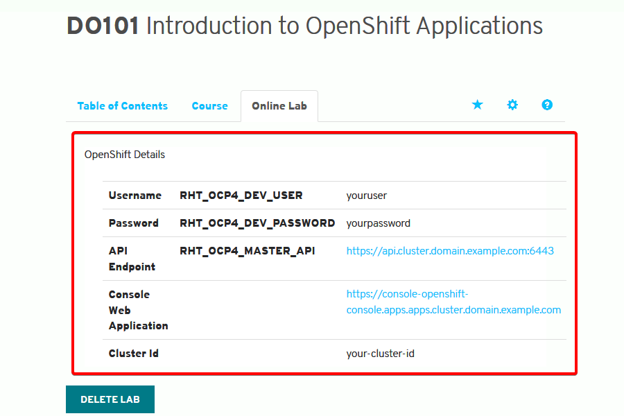

# Deploying and Managing apllication on Red Hat OpenShift.

## Introducing OpenShift Container Platform:

Red Hat OpenShift Container Platform is a self-service platform where development teams can deploy their applications. The platform integrates the tools to build and run applications, and manages the complete application life cycle from initial development to production.

OpenShift offers several deployment scenarios. One typical workflow starts when a developer provides the Git repository URL for an application to OpenShift.

The platform automatically retrieves the source code from Git, and then builds and deploys the application. The developer can also configure OpenShift to detect new Git commits, and then automatically rebuild and redeploy the application.
By automating the build and deployment processes, OpenShift allows developers to focus on application design and development. By rebuilding your application with every change you commit, OpenShift gives you immediate feedback. You can detect and fix errors early in the development process, before they become an issue in production.

OpenShift provides the building mechanisms, libraries, and runtime environments for the most popular languages, such as Java, Ruby, Python, PHP, .NET, Node.js, and many more. It also comes with a collection of additional services that you can directly use for your application, such as databases.

As traffic and load to your web application increases, OpenShift can rapidly provision and deploy new instances of the application components. For the Operations team, it provides additional tools for logging and monitoring.

## OpenShift Container Platform Architecture:
Red Hat OpenShift Online, at [here](https://www.openshift.com/), is a public OpenShift instance run by Red Hat. With that cloud platform, customers can directly deploy their applications online, without needing to install, manage, and update their own instance of the platform.

Red Hat also provides the Red Hat OpenShift Container Platform that companies can deploy on their own infrastructure. By deploying your own instance of OpenShift Container Platform, you can fine tune the cluster performance specific to your needs. In this classroom, you will be provided access to a private OpenShift cluster.

## Application Architecture:
Several development teams or customers usually share the same OpenShift platform. For security and isolation between projects and customers, OpenShift builds and runs applications in isolated containers. A container is a way to package an application with all its dependencies, such as runtime environments and libraries.

To manage the containerized applications, OpenShift adds a layer of abstraction known as the pod. Pods are the basic unit of work for OpenShift. A pod encapsulates a container, and other parameters, such as a unique IP address or storage. A pod can also group several related containers that share resources.

## Project-1: Deploying Applications to Red Hat OpenShift Container Platform:
In this exercise, I used the OpenShift web console to deploy a Node.js application.
**Outcomes**
we should be able to use the OpenShift web console to:
	• Create a new project.
	• Add a new application from a Git repository.
	• Inspect the resources that OpenShift creates during build and deployment.
	• To perform this exercise, ensure that the express-helloworld Node.js application is in your  GitHub DO101-app repository from the previous activity. Your changes should be in the devenv-versioning branch.
	• Red Hat Training manages an OpenShift cluster dedicated to this course. Your Red Hat Training Online Learning environment provides access to this platform.

